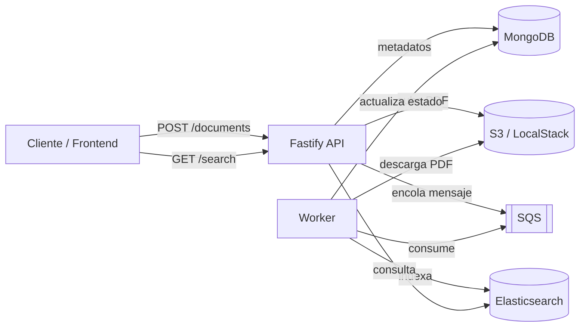
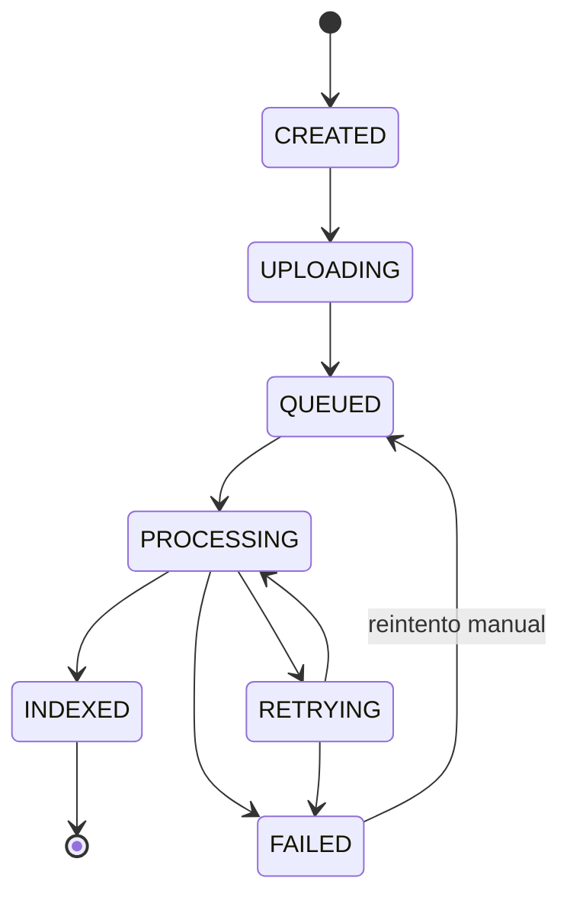

# StudyDocs Pipeline

[](https://github.com/navas98/studydocs-pipeline/actions/workflows/ci.yml)

> Un sistema de subida, procesamiento asíncrono, búsqueda e indexación de apuntes en PDF.

Construido como pieza de portfolio técnico para demostrar cómo abordo el diseño, la implementación y la
fiabilidad de un backend real: arquitectura hexagonal, procesamiento asíncrono desacoplado vía colas,
concurrencia segura, búsqueda full-text, observabilidad y una suite de tests que corre contra
infraestructura real en lugar de mocks.

**Demo en vivo (frontend):** `npm run dev` + `cd frontend && npm run build` → [http://localhost:3000](http://localhost:3000)
**Decisiones técnicas (ADRs):** [http://localhost:3000/decisions](http://localhost:3000/decisions) una vez levantado el proyecto

---

## Qué hace

1. Un usuario crea un documento (título, asignatura, universidad, tags) y sube un PDF.
2. La API sube el archivo a **S3** y publica un mensaje en **SQS**; el documento queda `QUEUED`.
3. Un **worker** independiente consume la cola, valida el PDF y lo indexa en **Elasticsearch**.
4. El estado del documento se puede seguir en tiempo real: `CREATED → UPLOADING → QUEUED → PROCESSING → INDEXED`
   (o `FAILED`, con reintento automático para errores transitorios y manual para permanentes).
5. Una vez indexado, el documento es buscable por texto libre, asignatura o universidad.



## Stack

| Capa | Tecnología |
|---|---|
| Lenguaje | Node.js 20+, TypeScript (strict) |
| API HTTP | Fastify 5 |
| Persistencia de metadatos | MongoDB (driver nativo) |
| Almacenamiento de ficheros | AWS S3 (LocalStack en local) |
| Cola de procesamiento | AWS SQS (LocalStack en local) |
| Búsqueda | Elasticsearch 8 |
| Frontend | React + Vite + TypeScript + Tailwind + Framer Motion |
| Tests | Vitest (unit, integración y e2e contra infraestructura real) |
| Orquestación local | Docker Compose |
| Logging | Pino (JSON estructurado, correlation IDs) |

## Arquitectura

Arquitectura hexagonal (puertos y adaptadores), de dentro hacia fuera:

```
src/
├── domain/           # Entidad Document y su máquina de estados — sin dependencias externas
├── application/       # Casos de uso + puertos (DocumentRepository, ObjectStorage, DocumentQueue, SearchIndex...)
├── infrastructure/    # Adaptadores concretos: MongoDB, S3, SQS, Elasticsearch, PDF processor, logging
├── interfaces/http/   # Composition root de la API: rutas Fastify, manejo de errores, health checks
├── worker/            # Composition root del worker: polling de SQS, métricas, reintentos
└── config/            # Carga y validación de variables de entorno
```

El dominio no sabe que existen Mongo, S3 o Elasticsearch; los casos de uso dependen de interfaces
(`application/`), no de implementaciones. Esto permite testear la lógica de negocio con dobles en memoria
y testear cada adaptador por separado contra infraestructura real.

Las decisiones de diseño (por qué está construido así, no solo qué hace) están documentadas como ADRs en
[`docs/decisions/`](docs/decisions/) y, con la misma información en formato visual, en la página
**[/decisions](http://localhost:3000/decisions)** del propio proyecto — concurrencia optimista,
idempotencia en el worker, mapping de Elasticsearch, testing sin mocks, manejo de errores centralizado,
correlation IDs, y por qué el frontend es una SPA de React servida como build estático.

## Trade-offs

- **Un worker, no cinco microservicios.** El procesamiento (validar PDF, indexar) es un único paso
  secuencial y ligero; separarlo en varios servicios solo añadiría saltos de red y despliegues que
  coordinar sin ganar nada, ya que no hay partes con necesidades de escalado distintas entre sí.
- **Elasticsearch es derivado, MongoDB es la fuente de verdad.** El índice de búsqueda se puede borrar y
  reconstruir a partir de Mongo en cualquier momento sin pérdida de datos; nunca se escribe primero en
  Elasticsearch. Esto simplifica el modelo mental: solo hay un sitio donde el estado de un documento es
  definitivo.
- **SQS obliga a que procesar sea idempotente.** La entrega "at-least-once" significa que el mismo
  mensaje puede procesarse más de una vez; en vez de luchar contra eso (deduplicación, locks
  distribuidos), el procesamiento está diseñado para que reprocesar un documento ya indexado sea
  simplemente redundante, no incorrecto.

## Rendimiento

Medición real, no estimada: `GET /documents?ownerId=` sembrando 50.000 documentos (25 del propietario
consultado, un ratio deliberadamente desfavorable) y comparando `explain('executionStats')` antes y
después de un índice compuesto `{ ownerId: 1, createdAt: -1 }`.

| | Documentos examinados | Tiempo |
|---|---|---|
| Sin índice (`COLLSCAN`) | 50.000 | 27 ms |
| Con índice (`IXSCAN`) | 25 | 1 ms |

Metodología completa, interpretación y qué cambiaría a mayor escala en
[`docs/performance.md`](docs/performance.md) — incluye también un test de carga ligero contra la API.
Los números son de un portátil de desarrollo, no de producción; lo relevante es la diferencia relativa
entre planes de ejecución, no los milisegundos absolutos.

```bash
npm run perf:mongo   # explain() antes/después del índice, sembrando 50k documentos
npm run perf:load     # carga ligera vía app.inject(), sin red real
```

## Máquina de estados de un documento



## Puesta en marcha

Requisitos: Docker, Node.js 20+.

```bash
# 1. Levantar infraestructura local (MongoDB, LocalStack S3+SQS, Elasticsearch)
docker compose up -d

# 2. Backend
npm install
cp .env.example .env
npm run dev      # API en http://localhost:3000
npm run worker   # en otra terminal — procesa la cola

# 3. Frontend (build estático servido por el propio Fastify)
cd frontend
npm install
npm run build    # genera frontend/dist, que Fastify sirve automáticamente
```

Con los tres procesos arriba, la demo completa está en **http://localhost:3000**.

Para desarrollar el frontend con hot-reload en lugar de reconstruir el build en cada cambio:

```bash
cd frontend
npm run dev      # http://localhost:5173, con proxy a la API en :3000
```

## API

| Método | Ruta | Descripción |
|---|---|---|
| `POST` | `/documents` | Crea un documento (metadatos) |
| `GET` | `/documents/:id` | Obtiene un documento por id |
| `GET` | `/documents?ownerId=` | Lista los documentos de un propietario |
| `PATCH` | `/documents/:id` | Actualiza metadatos (concurrencia optimista vía `version`) |
| `POST` | `/documents/:id/complete-upload` | Sube el PDF y encola el procesamiento |
| `GET` | `/documents/:id/file` | Descarga/visualiza el PDF |
| `POST` | `/documents/:id/retry` | Reintento manual tras un fallo permanente |
| `GET` | `/search` | Búsqueda por texto, asignatura y/o universidad |
| `GET` | `/health` | Readiness real: hace ping a MongoDB y Elasticsearch |
| `GET` | `/openapi.json` | Especificación OpenAPI generada por `@fastify/swagger` |

## Testing

La suite corre contra infraestructura real (MongoDB, LocalStack, Elasticsearch vía Docker Compose), no
contra mocks — decisión documentada en `/decisions`. Solo los tests unitarios de dominio usan dobles en
memoria.

```bash
docker compose up -d   # necesario para integración/e2e
npm run typecheck
npm run lint
npm test
```

82 tests (unit, integración, e2e) — 17 ficheros.

> Nota: el índice de Elasticsearch usado por los tests (`documents_test`) es independiente del que usan
> `dev`/el worker (`documents`), configurable vía `ELASTICSEARCH_INDEX`, así que correr la suite no borra
> los datos de una demo en marcha.

## Variables de entorno

Ver [`.env.example`](.env.example). Todas apuntan a los servicios de `docker-compose.yml` por defecto —
no hace falta cambiar nada para desarrollo local.

## Estructura del repositorio

```
.
├── src/                    # Backend (dominio, aplicación, infraestructura, HTTP, worker)
├── tests/                   # unit/, integration/, e2e/
├── frontend/                 # SPA React (portada, demo, decisiones técnicas)
├── docs/
│   ├── decisions/             # ADRs en Markdown (ver Arquitectura)
│   └── performance.md          # Ver Rendimiento
├── postman/                  # Colección para pruebas manuales de la API
├── scripts/                   # Scripts de análisis de rendimiento y carga
├── infra/                    # Scripts de inicialización de LocalStack
├── .github/workflows/ci.yml   # typecheck + lint + test en cada push/PR
└── docker-compose.yml         # MongoDB, LocalStack (S3+SQS), Elasticsearch
```

## Autor

Javier Navas — [j.navasdam@gmail.com](mailto:j.navasdam@gmail.com) · [github.com/navas98](https://github.com/navas98)
